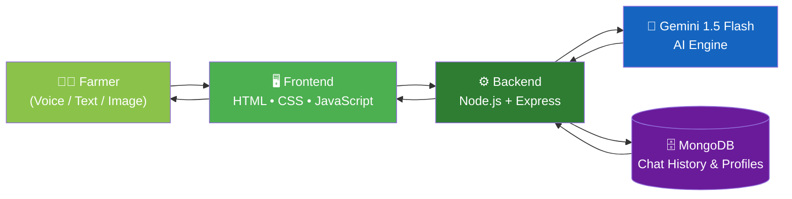
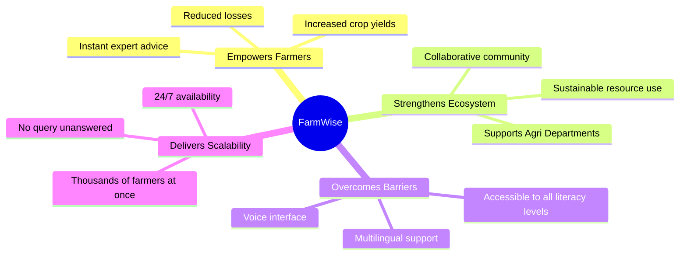

<div align="center">


### 🌾 Digital Krishi Officer &nbsp;•&nbsp; 🎙️ Voice-First Malayalam Support &nbsp;•&nbsp; 📸 Instant Crop Disease Diagnosis &nbsp;•&nbsp; 🤖 24/7 AI-Powered Advisory

<br/>


<br/>

<!-- ⚠️ The three badges below only render once this repo exists on GitHub —
     replace YOUR-USERNAME/YOUR-REPO with your real GitHub path -->


</div>

---

## 🌾 About The Project

**FarmWise** is an AI-powered, voice-first agricultural advisory platform built to act as a **Digital Krishi Officer** — a personal, always-available farming expert in every farmer's pocket. Designed specifically to solve **SIH25076: AI-Based Farmer Query Support and Advisory System**, FarmWise bridges the communication gap between farmers and expert agricultural knowledge using hyper-localized, multilingual, voice-enabled AI.

> *"No query goes unanswered. No farmer is left behind."*

<div align="center">

</div>

## ✨ What Makes FarmWise Special

<table>
<tr>
<td width="50%">

### 🎯 Hyper-Localized Intelligence
Advice tailored to your region's soil, climate, and crop patterns — not generic, one-size-fits-all answers.

### 👨‍🌾 A Holistic "Digital Krishi Officer"
One platform covering crop health, pest control, weather guidance, and government schemes.

### 🎙️ Superior Accessibility
Voice & Malayalam-first interface — built for farmers regardless of literacy level.

</td>
<td width="50%">

### 🤝 Integrated Community Ecosystem
A collaborative digital space where farmers share experiences and learn together.

### 🎨 Infographic UI/UX
Visual-first design that communicates complex agri-data at a glance.

### 📸 Visual Diagnosis
Snap a photo of a diseased crop and get instant, AI-powered diagnosis.

</td>
</tr>
</table>

## 🚀 Key Features

| Feature | Description |
|---|---|
| 🗣️ **Malayalam Voice-First Interface** | Speak your query naturally — no typing required |
| ✅ **KAU-Validated Advisory** | Pest & disease guidance verified against Kerala Agricultural University standards |
| 🌐 **Multilingual Support** | Starting with Malayalam, expanding to more Indian languages |
| 📷 **Instant Disease Diagnosis** | Upload/click a photo → get disease identification in seconds |
| 🔔 **Weekly Information Newsletter** | Fills the "information void" with curated, timely agri-updates |
| 👥 **Collaborative Farmer Community** | Peer-to-peer knowledge sharing and discussion forums |
| ⏰ **24/7 AI Advisory** | Round-the-clock support — no waiting on helplines |
| 📈 **Built to Scale** | Serves thousands of farmers simultaneously, unlike traditional call centers |

---

## 🏗️ System Architecture



## 🛠️ Tech Stack

<div align="center">

### Frontend


### Backend


### Database


### AI / ML


</div>

---

## 📊 Impact & Benefits



## 🧩 Feasibility & Approach

- ✅ **Technical Feasibility** — Powered by mature multilingual AI models and scalable cloud infrastructure.
- 🌍 **Regional Accuracy** — Partnering with **Kerala Agricultural University (KAU)** and government agri-portals to ensure validated, localized data.
- 🎯 **Trust & Simplicity** — UX designed for real-world farmer usability, not just tech-savvy users.
- 🌐 **Phased Language Rollout** — Launching with 3 core languages first, refining quality before scaling to more.

## 📚 Research & References

| Resource | Link |
|---|---|
| 🌱 Reference Model | [Plantix](https://plantix.net) |
| 🏛️ Kerala Agricultural University (KAU) | [kau.in](http://www.kau.in/) |
| 🏛️ Kerala Dept. of Agriculture Development & Farmers' Welfare | [keralaagriculture.gov.in](https://www.keralaagriculture.gov.in/) |
| 🏛️ Farmers' Portal (Govt. of India) | [farmer.gov.in](https://farmer.gov.in/) |
| 🔬 National Research Centre for IPM (NCIPM) | [ncipm.res.in](https://ncipm.res.in/) |

---

## ⚙️ Getting Started

### Prerequisites
```bash
Node.js >= 18.x
MongoDB >= 6.x
Gemini API Key
```

### Installation

```bash
# Clone the repository
git clone https://github.com/techcrafters/farmwise.git
cd farmwise

# Install backend dependencies
cd backend
npm install

# Set up environment variables
cp .env.example .env
# Add your GEMINI_API_KEY and MONGODB_URI

# Start the backend server
npm start
```

```bash
# In a new terminal, launch the frontend
cd frontend
# Open index.html in your browser or serve via a live server
```

## 🗂️ Project Structure

```
farmwise/
├── frontend/
│   ├── index.html
│   ├── css/
│   └── js/
├── backend/
│   ├── server.js
│   ├── routes/
│   ├── models/
│   └── controllers/
├── .env.example
└── README.md
```

---

## 👥 Team — Tech Crafters

<div align="center">

| Role | Details |
|---|---|
| 🏆 Problem Statement ID | SIH25076 |
| 📌 Theme | Agriculture |
| 💻 PS Category | Software |
| 👨‍💻 Team Name | Tech Crafters |

</div>

## 🤝 Contributing

Contributions are what make the open-source community amazing! Any contributions you make are **greatly appreciated**.

1. Fork the project
2. Create your feature branch (`git checkout -b feature/AmazingFeature`)
3. Commit your changes (`git commit -m 'Add some AmazingFeature'`)
4. Push to the branch (`git push origin feature/AmazingFeature`)
5. Open a Pull Request

## 📄 License

Distributed under the MIT License. See `LICENSE` for more information.

---

<div align="center">

### 🌾 Built with ❤️ for the farmers of India


</div>
